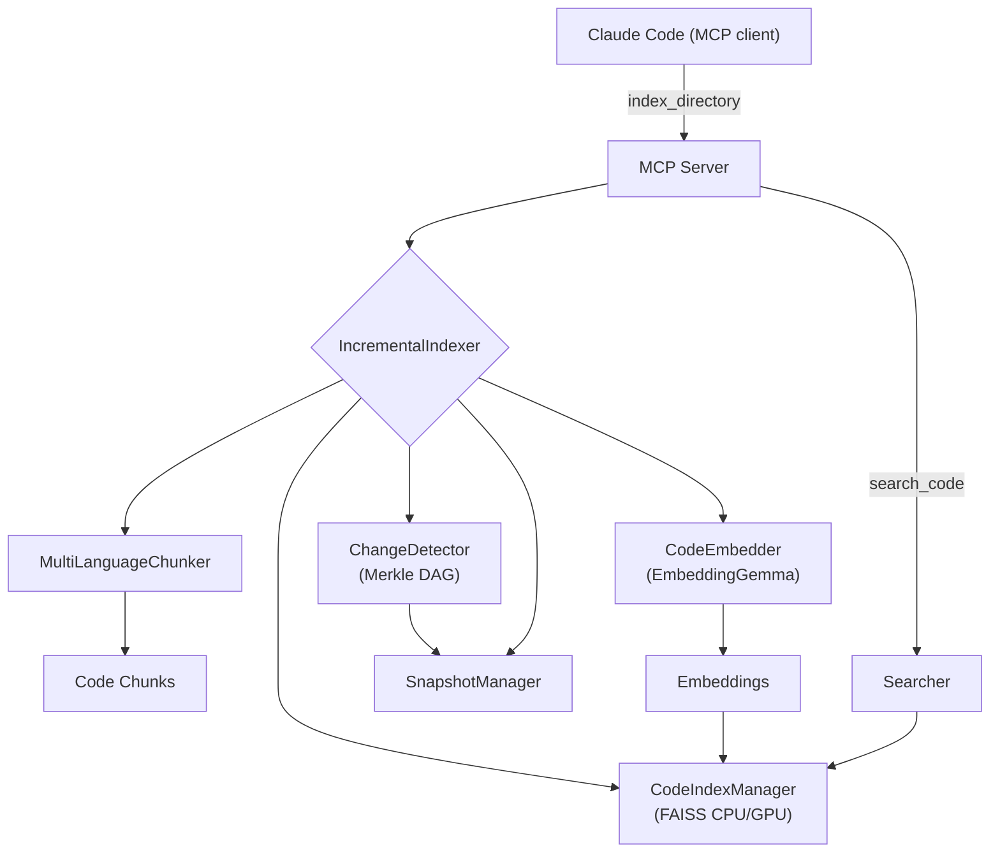

```
AGENT

  ██████╗  ██████╗  ███╗   ██╗ ████████╗ ███████╗ ██╗  ██╗ ████████╗
 ██╔════╝ ██╔═══██╗ ████╗  ██║ ╚══██╔══╝ ██╔════╝ ╚██╗██╔╝ ╚══██╔══╝
 ██║      ██║   ██║ ██╔██╗ ██║    ██║    █████╗    ╚███╔╝     ██║
 ██║      ██║   ██║ ██║╚██╗██║    ██║    ██╔══╝    ██╔██╗     ██║
 ╚██████╗ ╚██████╔╝ ██║ ╚████║    ██║    ███████╗ ██╔╝ ██╗    ██║
  ╚═════╝  ╚═════╝  ╚═╝  ╚═══╝    ╚═╝    ╚══════╝ ╚═╝  ╚═╝    ╚═╝

 ██╗       ██████╗   ██████╗  █████╗  ██╗
 ██║      ██╔═══██╗ ██╔════╝ ██╔══██╗ ██║
 ██║      ██║   ██║ ██║      ███████║ ██║
 ██║      ██║   ██║ ██║      ██╔══██║ ██║
 ███████╗ ╚██████╔╝ ╚██████╗ ██║  ██║ ███████╗
 ╚══════╝  ╚═════╝   ╚═════╝ ╚═╝  ╚═╝ ╚══════╝

```


Claude Context without the cloud. Semantic code search that runs 100% locally using local embedding models on your own machine. No API keys, no costs, your code never leaves your machine.

This fork tracks the upstream project at [tlines2016/claude-context-local](https://github.com/tlines2016/claude-context-local).

- 🔍 **Find code by meaning, not strings**
- 🔒 **100% local - completely private**
- 💰 **Zero API costs - forever free**
- ⚡ **Fewer tokens in Claude Code and fast local searches**

An intelligent code search system that uses Hugging Face embedding models and advanced multi-language chunking to provide semantic search capabilities across 22 file extensions, including Kotlin plus path-aware YAML/TOML/JSON config chunking, integrated with Claude Code via MCP (Model Context Protocol).

## 🚧 Beta Release

- Core functionality working
- Installer flows documented for macOS, Linux, WSL2, Git Bash, and Windows PowerShell
- Benchmarks coming soon
- Please report issues!

## Demo

Demo media for this fork is being refreshed. In the meantime, use the install commands and `python scripts/cli.py setup-guide` examples below to verify the local setup flow on your OS.

## Features

- **Multi-language support**: 22 file extensions across Python, JavaScript, TypeScript, Java, Kotlin, Markdown, Go, Rust, C, C++, C#, Svelte, YAML, TOML, and JSON
- **Intelligent chunking**: AST-based (Python) + tree-sitter (JS/TS/Go/Java/Kotlin/Markdown/Rust/C/C++/C#) + path-aware structured config chunking (YAML/TOML/JSON)
- **Semantic search**: Natural language queries to find code across all languages
- **Rich metadata**: File paths, folder structure, semantic tags, language-specific info
- **MCP integration**: Direct integration with Claude Code
- **Local processing**: All embeddings stored locally, no API calls
- **Fast search**: FAISS for efficient similarity search

## Why this

Claude’s code context is powerful, but sending your code to the cloud costs tokens and raises privacy concerns. This project keeps semantic code search entirely on your machine. It integrates with Claude Code via MCP, so you keep the same workflow—just faster, cheaper, and private.

## Requirements

- Python 3.12+
- Disk: 1–2 GB free for the default model (larger alternatives need more)
- Optional: NVIDIA GPU (CUDA 11/12) for FAISS acceleration; Apple Silicon (MPS) for embedding acceleration. These also speed up running the embedding model with SentenceTransformer, but everything still works on CPU.

## 5-Minute Setup

If you just want the shortest path to a working local setup:

1. **Run the installer for your OS** from the commands in [Install & Update](#install--update).
2. **If Hugging Face prompts for access**, accept the model terms and run:

   ```bash
   hf auth login
   hf auth whoami
   ```

   If you are using a different shell than the one where you logged in, set `HF_TOKEN` in that same shell before retrying the install.

3. **Register the MCP server**:

   ```bash
   claude mcp add code-search --scope user -- uv run --directory ~/.local/share/claude-context-local python mcp_server/server.py
   ```

4. **Verify the setup**:

   ```bash
   python scripts/cli.py doctor
   claude mcp list
   ```

5. **Open Claude Code in your project** and say:

   ```text
   index this codebase
   ```

For platform-specific variations, run `python scripts/cli.py setup-guide`.

## Install & Update

### Install (one‑liner)

> **Before running any installer:** You can review the scripts at
> [install.sh](https://github.com/tlines2016/claude-context-local/blob/main/scripts/install.sh)
> and [install.ps1](https://github.com/tlines2016/claude-context-local/blob/main/scripts/install.ps1)
> on GitHub before executing them. This is best practice when piping scripts from the internet
> directly into a shell.

#### macOS / Linux / Git Bash

```bash
curl -fsSL https://raw.githubusercontent.com/tlines2016/claude-context-local/main/scripts/install.sh | bash
```

If your system doesn't have `curl`, you can use `wget`:

```bash
wget -qO- https://raw.githubusercontent.com/tlines2016/claude-context-local/main/scripts/install.sh | bash
```

#### Windows PowerShell

```powershell
irm https://raw.githubusercontent.com/tlines2016/claude-context-local/main/scripts/install.ps1 | iex
```

If PowerShell blocks script execution in your shell, use:

```powershell
powershell -ExecutionPolicy Bypass -c "irm https://raw.githubusercontent.com/tlines2016/claude-context-local/main/scripts/install.ps1 | iex"
```

#### Windows Command Prompt (`cmd.exe`)

Open PowerShell from cmd and run the PowerShell installer:

```bat
powershell -ExecutionPolicy Bypass -c "irm https://raw.githubusercontent.com/tlines2016/claude-context-local/main/scripts/install.ps1 | iex"
```

#### WSL2 (Windows Subsystem for Linux)

Install from your WSL terminal using the bash installer:

```bash
curl -fsSL https://raw.githubusercontent.com/tlines2016/claude-context-local/main/scripts/install.sh | bash
```

The installer automatically detects WSL2 and provides WSL-specific guidance after
completion. If Claude Desktop is installed on the Windows side, you may need to
register the MCP server from a Windows terminal as well.

### Update existing installation

Run the same install command to update:

```bash
curl -fsSL https://raw.githubusercontent.com/tlines2016/claude-context-local/main/scripts/install.sh | bash
```

On Windows, re-run the PowerShell command instead:

```powershell
irm https://raw.githubusercontent.com/tlines2016/claude-context-local/main/scripts/install.ps1 | iex
```

The installer will:

- Detect your existing installation
- Preserve your embeddings and indexed projects in `~/.claude_code_search`
- Stash any local changes automatically (if running via curl)
- Update the code and dependencies

### Pick an embedding model during local install

Model changes are now intended to happen through the local installation, not through MCP commands.

Before running the installer, set `CODE_SEARCH_MODEL` to the Hugging Face model you want:

```bash
export CODE_SEARCH_MODEL=Qwen/Qwen3-Embedding-0.6B
curl -fsSL https://raw.githubusercontent.com/tlines2016/claude-context-local/main/scripts/install.sh | bash
```

```powershell
$env:CODE_SEARCH_MODEL="Qwen/Qwen3-Embedding-0.6B"
irm https://raw.githubusercontent.com/tlines2016/claude-context-local/main/scripts/install.ps1 | iex
```

The installer downloads the chosen model and persists the selection in:

```text
~/.claude_code_search/install_config.json
```

To switch models later, set a new `CODE_SEARCH_MODEL` and re-run the installer.

### What the installer does

- Installs `uv` if missing and creates a project venv
- Clones/updates `claude-context-local` in `~/.local/share/claude-context-local` on Unix-like shells or `%LOCALAPPDATA%\claude-context-local` on PowerShell
- Installs Python dependencies with `uv sync`
- Downloads the selected embedding model if not already cached
- Tries to install `faiss-gpu` if an NVIDIA GPU is detected (interactive mode only)
- **Preserves all your indexed projects and embeddings** across updates
- If model download auth is not ready yet, the installer now completes and tells you how to retry later

## Quick Start

### 1) Register the MCP server (stdio)

```bash
claude mcp add code-search --scope user -- uv run --directory ~/.local/share/claude-context-local python mcp_server/server.py
```

PowerShell example:

```powershell
claude mcp add code-search --scope user -- uv run --directory "$env:LOCALAPPDATA\claude-context-local" python mcp_server/server.py
```

Then open Claude Code; the server will run in stdio mode inside the `uv` environment.

### 2) Index your codebase

Open Claude Code and say: index this codebase. No manual commands needed.

### 3) Use in Claude Code

Interact via chat inside Claude Code; no function calls or commands are required.

### 4) CLI diagnostics (optional)

A CLI tool is included for troubleshooting and setup guidance:

| Command | What it helps with |
| --- | --- |
| `python scripts/cli.py help` | Show available commands and examples |
| `python scripts/cli.py doctor` | Check Python, packages, storage, model cache, and platform-specific issues |
| `python scripts/cli.py setup-guide` | Print OS-specific installation and MCP registration steps |
| `python scripts/cli.py status` | Show indexed projects and current index status |
| `python scripts/cli.py paths` | Show where models, storage, and config files live |
| `python scripts/cli.py version` | Print version, platform, and Python details |

The `doctor` command verifies your Python version, checks dependencies, validates
storage directories, and detects WSL2/Windows environments.

### 5) Optional manual indexing from the CLI

If you want to validate indexing outside Claude Code first:

```bash
./scripts/index_codebase.py /path/to/project
python scripts/cli.py status
```

That gives you a quick sanity check before you register or troubleshoot MCP integration.

## Architecture

```
claude-context-local/
├── chunking/                         # Multi-language chunking (22 extensions)
│   ├── multi_language_chunker.py     # Unified orchestrator (Python AST + tree-sitter + structured config)
│   ├── structured_data_chunker.py    # Semantic chunking for YAML/TOML/JSON config files
│   ├── python_ast_chunker.py         # Python-specific chunking (rich metadata)
│   └── tree_sitter.py                # Tree-sitter: JS/TS/JSX/TSX/Svelte/Go/Java/Kotlin/Markdown/Rust/C/C++/C#
├── embeddings/
│   └── embedder.py                   # Install-selected embedding model; device=auto (CUDA→MPS→CPU); offline cache
├── search/
│   ├── indexer.py                    # FAISS index (CPU by default; GPU when available)
│   ├── searcher.py                   # Intelligent ranking & filters
│   └── incremental_indexer.py        # Merkle-driven incremental indexing
├── merkle/
│   ├── merkle_dag.py                 # Content-hash DAG of the workspace
│   ├── change_detector.py            # Diffs snapshots to find changed files
│   └── snapshot_manager.py           # Snapshot persistence & stats
├── mcp_server/
│   └── server.py                     # MCP tools for Claude Code (stdio/HTTP)
└── scripts/
    ├── install.sh                    # One-liner remote installer (uv + model + faiss)
    ├── install.ps1                   # PowerShell installer for Windows
    ├── cli.py                        # CLI diagnostics and help tool
    ├── download_model_standalone.py  # Pre-fetch embedding model
    └── index_codebase.py             # Standalone indexing utility
```

### Data flow



## Intelligent Chunking

The system uses advanced parsing to create semantically meaningful chunks across all supported languages:

### Chunking Strategies

- **Python**: AST-based parsing for rich metadata extraction
- **Programming languages and Markdown**: Tree-sitter parsing with language-specific node type recognition
- **Structured config files**: Path-aware sections for YAML, TOML, and JSON inspired by modern indexing pipelines

### Chunk Types Extracted

- **Functions/Methods**: Complete with signatures, docstrings, decorators
- **Classes/Structs**: Full definitions with member functions as separate chunks
- **Interfaces/Traits**: Type definitions and contracts
- **Enums/Constants**: Value definitions and module-level declarations
- **Namespaces/Modules**: Organizational structures
- **Templates/Generics**: Parameterized type definitions
- **Config sections/entries**: Top-level and nested composite settings for YAML, TOML, and JSON

### Rich Metadata for All Languages

- File path and folder structure
- Function/class/type names and relationships
- Language-specific features (async, generics, modifiers, etc.)
- Structured config section paths
- Parent-child relationships (methods within classes)
- Line numbers for precise code location
- Semantic tags (component, export, async, etc.)

## Configuration

### Environment Variables

- `CODE_SEARCH_STORAGE`: Custom storage directory (default: `~/.claude_code_search`)

### Indexing Controls

If a repository contains very large or low-signal structured files, configure indexing with a project-local `.claude-context-local.json` file:

```json
{
  "exclude_extensions": [".toml"],
  "max_structured_file_lines": 50000,
  "max_structured_file_bytes": 5000000
}
```

- `exclude_extensions`: Skip specific file types entirely, such as `.toml` for large generated configs.
- `max_structured_file_lines`: Skip oversized YAML/TOML/JSON files before chunking.
- `max_structured_file_bytes`: Skip oversized YAML/TOML/JSON files by byte size.

Environment variables can override these settings for one-off runs:

- `CODE_SEARCH_EXCLUDE_EXTENSIONS=.toml,.json`
- `CODE_SEARCH_MAX_STRUCTURED_FILE_LINES=75000`
- `CODE_SEARCH_MAX_STRUCTURED_FILE_BYTES=8000000`

When these indexing controls change, incremental/MCP indexing automatically performs a full rebuild so stale chunks from newly excluded file types are removed. The standalone `scripts/index_codebase.py` command also clears the previous index automatically when the indexing configuration changes.

### Model Configuration

The system still defaults to `google/embeddinggemma-300m`, but the selected model is now persisted with the local installation so you can switch models by re-running the installer.

Notes:

- Download size: ~1.2–2 GB on disk depending on variant and caches
- Device selection: auto (CUDA on NVIDIA, MPS on Apple Silicon, else CPU)
- You can pre-download via installer or at first use
- FAISS backend: CPU by default. If an NVIDIA GPU is detected, the installer
  attempts to install `faiss-gpu-cu12` (or `faiss-gpu-cu11`) and the index will
  run on GPU automatically at runtime while saving as CPU for portability.

#### Hugging Face authentication (if prompted)

The `google/embeddinggemma-300m` model is hosted on Hugging Face and may require
accepting terms and/or authentication to download.

1. Visit the model page and accept any terms:

   - https://huggingface.co/google/embeddinggemma-300m

2. Authenticate one of the following ways:

    - CLI (recommended):

      ```bash
      hf auth login
      hf auth whoami
      # Older CLI builds may still use: huggingface-cli login
      # Paste your token from https://huggingface.co/settings/tokens
      ```

      `huggingface-cli login` is the older command name. If `huggingface-cli` is missing but
      `hf` works, prefer `hf auth login`.

    - Environment variable:
      ```bash
      export HF_TOKEN=hf_XXXXXXXXXXXXXXXXXXXXXXXX
      ```

      PowerShell:
      ```powershell
      $env:HF_TOKEN="hf_XXXXXXXXXXXXXXXXXXXXXXXX"
      ```

      Command Prompt:
      ```bat
      set HF_TOKEN=hf_XXXXXXXXXXXXXXXXXXXXXXXX
      ```

      We also support `HUGGING_FACE_HUB_TOKEN` for compatibility.

3. If you use Git Bash on Windows, remember that `hf auth login` done in PowerShell or cmd may
   store the token under your Windows profile while Git Bash uses a different `HOME`. If that
   happens, set `HF_TOKEN` explicitly in the same shell where you run the installer.

4. A quick validation checklist before re-running install:

   - `hf auth whoami` shows your Hugging Face account
   - you already accepted the model terms on the model page
   - `python scripts/cli.py doctor` reports the expected storage/model paths
   - if you are on WSL, Git Bash, or switching shells, `HF_TOKEN` is exported in the current shell

After the first successful download, we cache the model under `~/.claude_code_search/models`
and prefer offline loads for speed and reliability.

#### Recommended March 2026 model candidates for a 16 GB RTX 5080 setup

These are the most practical models to benchmark first for this project's current architecture:

| Model | Why test it | Practical note |
| --- | --- | --- |
| `google/embeddinggemma-300m` | Best-tested option in this repo and still the safest default | Lowest migration risk |
| `Qwen/Qwen3-Embedding-0.6B` | Strong modern general-purpose embedding candidate for local GPU-backed retrieval | Good first upgrade candidate for RTX 5080-class hardware |
| `Salesforce/SFR-Embedding-Code-400M_R` | Code-oriented retrieval candidate when repository search quality matters more than generic text retrieval | Worth testing on code-heavy repositories |

If you need a model that performs best with custom prefixes or prompts, you can edit `install_config.json` after install:

```json
{
  "embedding_model": {
    "model_name": "intfloat/e5-base-v2",
    "query_prefix": "query: ",
    "document_prefix": "passage: "
  }
}
```

This repo now reads that local install config automatically when `CODE_SEARCH_MODEL` is not set.

#### A note on Qwen3.5 GGUFs

`unsloth/Qwen3.5-35B-A3B-GGUF` is **not** a good drop-in embedding model for this project. GGUF is a quantized model format mainly used by local inference engines such as `llama.cpp`, and this specific checkpoint is a generative chat/coding model rather than a SentenceTransformer-compatible embedding model. This repository's indexing pipeline expects dense retrieval vectors from an embedding model, so Qwen3.5 GGUFs are better treated as local coding assistants than as the embedding backend here.

If you want to evaluate Unsloth-hosted embedding candidates instead, start with their embedding collection rather than the Qwen3.5 GGUF chat models:

- https://huggingface.co/collections/unsloth/embedding-models

#### Fine-tuning with Unsloth

If your repositories are highly domain-specific, fine-tuning an embedding model can improve retrieval quality more than swapping between off-the-shelf checkpoints.

Unsloth now supports fine-tuning SentenceTransformer-compatible embedding models such as:

- `google/embeddinggemma-300m`
- `Qwen/Qwen3-Embedding-0.6B`
- `BAAI/bge-m3`
- `sentence-transformers/all-MiniLM-L6-v2`
- `sentence-transformers/all-mpnet-base-v2`

Useful references:

- Unsloth embedding collection: https://huggingface.co/collections/unsloth/embedding-models
- Unsloth notebooks: EmbeddingGemma, Qwen3-Embedding, BGE M3, ModernBERT, and All-MiniLM-L6-v2

For this repo, the practical workflow is:

1. Fine-tune and export a merged SentenceTransformer-compatible model with Unsloth.
2. Publish it to Hugging Face or keep it as a local folder.
3. Point the installer at that model with `CODE_SEARCH_MODEL=<your-model>` before re-running install.
4. If you need custom query/document prefixes, store them in `install_config.json` alongside the model name.

That keeps the retrieval stack unchanged while still letting you move to a domain-tuned embedding model later.

### Supported Languages & Extensions

**Fully Supported (22 extensions across 15 languages/content types):**

| Language       | Extensions                    |
| -------------- | ----------------------------- |
| **Python**     | `.py`                         |
| **JavaScript** | `.js`, `.jsx`                 |
| **TypeScript** | `.ts`, `.tsx`                 |
| **Java**       | `.java`                       |
| **Kotlin**     | `.kt`, `.kts`                 |
| **Markdown**   | `.md`                         |
| **Go**         | `.go`                         |
| **Rust**       | `.rs`                         |
| **C**          | `.c`                          |
| **C++**        | `.cpp`, `.cc`, `.cxx`, `.c++` |
| **C#**         | `.cs`                         |
| **Svelte**     | `.svelte`                     |
| **YAML**       | `.yaml`, `.yml`               |
| **TOML**       | `.toml`                       |
| **JSON**       | `.json`                       |

**Total**: **22 file extensions** across **15 languages/content types**

## Storage

Data is stored in the configured storage directory:

```
~/.claude_code_search/
├── models/          # Downloaded models
├── index/           # FAISS indices and metadata
│   ├── code.index   # Vector index
│   ├── metadata.db  # Chunk metadata (SQLite)
│   └── stats.json   # Index statistics
```

## Performance

- **Model size**: ~1.2GB (EmbeddingGemma-300m and caches)
- **Embedding dimension**: 768 (can be reduced for speed)
- **Index types**: Flat (exact) or IVF (approximate) based on dataset size
- **Batch processing**: Configurable batch sizes for embedding generation

Tips:

- First index on a large repo will take time (model load + chunk + embed). Subsequent runs are incremental.
- With GPU FAISS, searches on large indexes are significantly faster.
- Embeddings automatically use CUDA (NVIDIA) or MPS (Apple) if available.

## Troubleshooting

### Quick Diagnostics

Run the built-in health checker to identify common issues:

```bash
python scripts/cli.py doctor
```

This checks Python version, dependencies, storage paths, model cache, and platform-specific concerns (WSL2, Windows path mismatches, etc.).

If you are still stuck after `doctor`, run:

```bash
python scripts/cli.py setup-guide
python scripts/cli.py paths
python scripts/cli.py status
```

### Common Issues

| Problem | What to do |
| --- | --- |
| Import errors | Run `uv sync` from the repository root so the expected dependencies are installed into the project environment. |
| Model download fails | Check network access, free disk space, Hugging Face auth, and whether you accepted the model terms on the model page. |
| `401 Unauthorized` or gated model errors | Run `hf auth whoami`. If that succeeds but install still fails, set `HF_TOKEN` in the same shell where you run the installer and retry. |
| WSL2 / Git Bash token mismatch | Run `python scripts/cli.py doctor` to confirm Windows interop. If Hugging Face tokens cached on Windows are not visible in the current shell, export `HF_TOKEN` explicitly. |
| No search results | Re-index the repository, then run `python scripts/cli.py status` to confirm the project was indexed. |
| Memory pressure during indexing | Try a smaller embedding model or index a smaller repository first to validate the setup end to end. |
| FAISS GPU not used | Ensure `nvidia-smi` works and CUDA drivers are installed, then re-run the installer so it can select the GPU FAISS package when available. |
| Need to work fully offline | We already prefer cached models automatically; you can also set `HF_HUB_OFFLINE=1`. |

### Ignored directories (for speed and noise reduction)

`node_modules`, `.venv`, `venv`, `env`, `.env`, `.direnv`, `__pycache__`, `.pytest_cache`, `.mypy_cache`, `.ruff_cache`, `.pytype`, `.ipynb_checkpoints`, `build`, `dist`, `out`, `public`, `.next`, `.nuxt`, `.svelte-kit`, `.angular`, `.astro`, `.vite`, `.cache`, `.parcel-cache`, `.turbo`, `coverage`, `.coverage`, `.nyc_output`, `.gradle`, `.idea`, `.vscode`, `.docusaurus`, `.vercel`, `.serverless`, `.terraform`, `.mvn`, `.tox`, `target`, `bin`, `obj`

## Contributing

This is a research project focused on intelligent code chunking and search. Feel free to experiment with:

- Different chunking strategies
- Alternative embedding models
- Enhanced metadata extraction
- Performance optimizations

## License

Licensed under the GNU General Public License v3.0 (GPL-3.0). See the `LICENSE` file for details.

## Inspiration

This project draws inspiration from [zilliztech/claude-context](https://github.com/zilliztech/claude-context). I adapted the concepts to a Python implementation with fully local embeddings.
